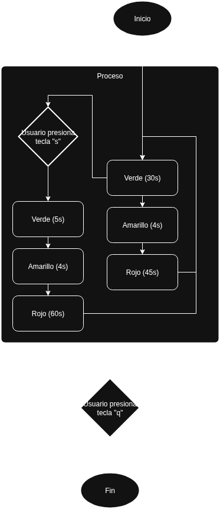

# Semáforo interactivo con botón de cruce y braille

## Descripción

Esta aplicación muestra un semáforo simulado usando OpenCV con tres luces (rojo, amarillo, verde) y un **botón de cruce peatonal** dibujado en la misma ventana. El botón incluye una representación visual de puntos en **braille** colocados arriba de la palabra `PUSH` para servir como guía de diseño físico del relieve.

Además incluye comportamiento interactivo por teclado y sonido cuando se suelta el botón.

---

## Funcionalidades principales

* Semáforo con ciclo: **verde 30s → amarillo 5s → rojo 30s**.
* En los últimos **5 segundos** de la fase verde, la luz verde **parpadea** (0.5 s on / 0.5 s off).
* Teclas interactivas:

  * `q` o `Esc`: salir de la aplicación.
  * `i`: alterna la visualización del texto con la luz activa y el tiempo restante.
  * `s`:
    * Si la luz está en **verde** y faltan más de 5 segundos, el tiempo restante se acorta a **5 s** (sin cambiar la duración base de la fase).
    * Si no se está en rojo, la **próxima fase roja** se programa para durar **60 s**.
    * Al **soltar** la tecla `s` se reproduce un sonido (archivo MP3 configurado).
* Botón visual que se oscurece y se mueve ligeramente hacia abajo cuando `s` está presionada (efecto de hundimiento).
* Dibujo de puntos braille: se demuestra la palabra "PUSH" en Braille utilizando puntos negros para representar relieve.

---

## Archivos relevantes

* `semaforo_braille.py` — Script principal (ejecutable).
* `requirements.txt` — Dependencias Python necesarias.
* `assets/beep2.mp3` — (opcional) archivo de sonido para el botón. Ajusta la ruta en la variable `SOUND_FILE` dentro del script si lo colocas en otra ubicación.

---

## Requisitos

Se recomienda crear un entorno virtual y luego instalar dependencias:

```bash
pip install -r requirements.txt
```

Dependencias principales incluidas en `requirements.txt`:

* numpy
* opencv-python
* pygame
* Pillow

> Nota: la reproducción de MP3 con `pygame` puede requerir paquetes del sistema (ALSA/PulseAudio) en Linux.

---

## Cómo ejecutar

1. Asegúrate de tener las dependencias instaladas (`pip install -r requirements.txt`).
2. Coloca tu MP3 en la ruta indicada por `SOUND_FILE` dentro del script (por defecto `assets/beep2.mp3`).
3. Ejecuta:

```bash
python semaforo_braille.py
```

La ventana mostrará el semáforo y el botón interactivo.

---

Diagrama de flujo:
